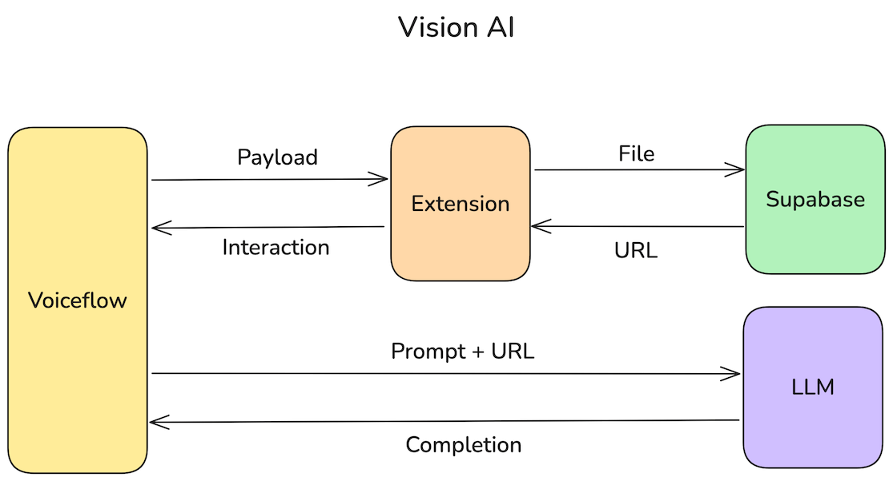

# Vision AI in Voiceflow

Add vision capabilities to your Voiceflow agent with OpenAI and Anthropic

### Flow



### How To

**Supabase Uploads**

1. Create a supabase bucket from the Supabase UI
2. Add a policy to allow public uploads:

```sql
CREATE POLICY "allow uploads" ON storage.objects FOR INSERT TO public WITH CHECK (bucket_id = 'your-bucket-name');
```

**Voiceflow Extension**

1. Import the `image_upload.ext.js` extension in your Voiceflow installation snippet
2. Set up the custom extension in your Voiceflow project

Check the provided template for reference: Vision_Agent.vf

**AI Functions**

1. Pass the image URL to an AI model using the provided functions
2. Use the response of the AI model in your prompt

### Demo

You can run the demo project with the following command:

```sh
npx serve src
```

### Resources

**Marketplace**

- [Vision AI Template](https://www.voiceflow.com/templates/vision-ai-with-gpt-claude-and-supabase)
- [Vision AI with OpenAI Function](https://www.voiceflow.com/templates/vision-ai-with-openai-responses-api)
- [Vision AI with Anthropic Function](https://www.voiceflow.com/templates/vision-ai-with-anthropic-messages-api)

**Video**

- [YouTube Video](https://www.youtube.com/)

**Vision AI**

- https://platform.openai.com/docs/guides/images?api-mode=responses
- https://docs.anthropic.com/en/docs/build-with-claude/vision

**More**

- https://www.voiceflow.com/contributors/juan-carlos-quintero
- https://docs.voiceflow.com/docs/custom-web-chat-widgets
- https://supabase.com/docs/guides/storage/uploads/standard-uploads
- https://supabase.com/docs/reference/javascript/storage-from-upload
- https://supabase.com/docs/reference/javascript/storage-from-getpublicurl
- https://github.com/supabase/supabase/tree/master/examples/storage/resumable-upload-uppy
